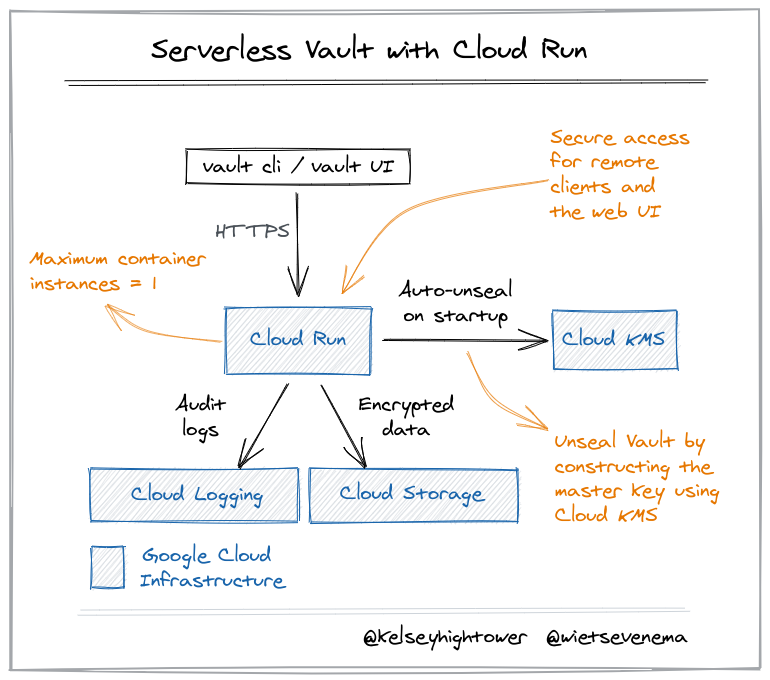

# Serverless Vault with Cloud Run

This tutorial walks you through deploying Hashicorp's [Vault](https://www.vaultproject.io) on [Cloud Run](https://cloud.google.com/run), Google Cloud's container based Serverless compute platform.



## Rational

Vault is a tool for encrypting data, managing secrets, and auditing access to them. Vault should be deployed to a secure and highly available environment to ensure applications have reliable access to secrets and credentials. Vault can leverage managed services such as [Cloud KMS](https://cloud.google.com/security-key-management) and [Google Cloud Storage](https://cloud.google.com/storage) to protect and store its data, and [Cloud Run](https://cloud.google.com/run) to serve it and capture audit logs.

While Vault can be deployed to Kubernetes, or a virtual machine, Cloud Run reduces operational complexity by delegating infrastructure management to the cloud provider. Cloud Run can scale Vault to zero when not in use, or be configured to [keep a single instance available](https://cloud.google.com/run/docs/configuring/min-instances) to serve [concurrent request](https://cloud.google.com/run/docs/configuring/concurrency) at the lowest latency possible. Cloud Run automatically captures Vault's audit logs and sends them to [Cloud Logging](https://cloud.google.com/logging/docs) for centralized storage and analysis.

> Cloud Run can also be configured to ensure only one instance of Vault is running at a given time. See the Cloud Run [maximum instances docs](https://cloud.google.com/run/docs/configuring/max-instances).

## Tutorial

Create a new Google Cloud project:

```
gcloud projects create \
  --name vault-on-cloud-run \
  --set-as-default
```

Type `y` at the prompt and press `enter`:

```
No project id provided.

Use [vault-on-cloud-run-XXXXXX] as project id (Y/n)?  y
```

Before you can continue you must [enable billing](https://cloud.google.com/billing/docs/how-to/modify-project) on the project to enable the use of Cloud KMS as an [auto-unseal](https://learn.hashicorp.com/tutorials/vault/autounseal-gcp-kms) mechanism.

To streamline the rest of the tutorial define the key configuration settings and assign them to environment variables:

```
PROJECT_ID=$(gcloud config get-value project)
```
> `PROJECT_ID` holds the project id generated at the start of the tutorial.

```
GCS_BUCKET_NAME="${PROJECT_ID}-data"
```

> `GCS_BUCKET_NAME` holds the Google Cloud Storage bucket name used to persist Vault's data.

```
SERVICE_ACCOUNT_EMAIL="vault-server@${PROJECT_ID}.iam.gserviceaccount.com"
```

> `SERVICE_ACCOUNT_EMAIL` holds the Google Cloud IAM email address representing the `vault-server` service account.

```
CURRENT_USER_EMAIL=$(gcloud config list account --format "value(core.account)")
```

> `CURRENT_USER_EMAIL` holds the email address representing the current logged in Google Cloud user.

```
REGION=us-west1
```

> `REGION` holds the region in which to deploy the vault-server.


Enable the Cloud KMS, Cloud Run, Cloud Storage, and Secret Manager APIs:

```
gcloud services enable --async \
  cloudkms.googleapis.com \
  run.googleapis.com \
  secretmanager.googleapis.com \
  storage.googleapis.com
```

Create a service account for the Vault server:

```
gcloud iam service-accounts create vault-server
```

Create a GCS storage bucket to hold Vault's encrypted data:

```
gsutil mb gs://${GCS_BUCKET_NAME}
```
```
Creating gs://vault-on-cloud-run-XXXXXX-data/...
```

Grant the necessary permissions on GCS storage bucket for the `vault-server` service account:

```
gsutil iam ch \
  serviceAccount:${SERVICE_ACCOUNT_EMAIL}:objectAdmin \
  gs://${GCS_BUCKET_NAME}
```

Store the vault server config file in [Secret Manager](https://cloud.google.com/secret-manager):

```
gcloud secrets create vault-server-config \
  --replication-policy automatic \
  --data-file vault-server.hcl
```

Grant access to the `vault-server-config` secret to the `vault-server` service account:

```
gcloud secrets add-iam-policy-binding vault-server-config \
  --member "serviceAccount:${SERVICE_ACCOUNT_EMAIL}" \
  --role "roles/secretmanager.secretAccessor"
```

Create a Cloud KMS key ring that will be used to hold Vault `seal` encryption key:

```
gcloud kms keyrings create "vault-server" \
  --location "global"
```

Create the Cloud KMS encryption key that will be used to [encrypt and decrypt the Vault master key](https://www.vaultproject.io/docs/configuration/seal/gcpckms):

```
gcloud kms keys create "seal" \
  --location "global" \
  --keyring "vault-server" \
  --purpose "encryption"
```

Grant the necessary permissions on the `seal` Cloud KMS encryption key for the `vault-server` service account:

```
gcloud kms keys add-iam-policy-binding seal \
  --keyring "vault-server" \
  --location "global" \
  --member serviceAccount:${SERVICE_ACCOUNT_EMAIL} \
  --role roles/cloudkms.cryptoKeyEncrypterDecrypter
```

Deploy the `vault-server` Cloud Run service:

> The initial deployment will be made private to prevent someone else from initializing the Vault server. Clients will need to [provide authentication credentials](https://cloud.google.com/run/docs/authenticating/developers) that will be validated by the Cloud Run control plane. After Vault has been initialized the Cloud Run deployment will be updated to bypass Cloud Run authentication and delegate the authentication to Vault. 

```
gcloud beta run deploy vault-server \
  --no-allow-unauthenticated \
  --concurrency 50 \
  --cpu 2 \
  --image gcr.io/hightowerlabs/vault:1.7.1 \
  --no-cpu-throttling \
  --memory '2G' \
  --min-instances 1 \
  --max-instances 1 \
  --platform managed \
  --port 8200 \
  --service-account ${SERVICE_ACCOUNT_EMAIL} \
  --set-env-vars="GOOGLE_PROJECT=${PROJECT_ID},GOOGLE_STORAGE_BUCKET=${GCS_BUCKET_NAME}" \
  --set-secrets="/etc/vault/config.hcl=vault-server-config:1" \
  --timeout 300 \
  --region ${REGION}
```

Grant permission to the current logged in GCP user to invoke the `vault-server` Cloud Run service:

```
gcloud run services add-iam-policy-binding vault-server \
  --member="user:${CURRENT_USER_EMAIL}" \
  --role='roles/run.invoker' \
  --platform managed \
  --region ${REGION}
```

Retrieve the `vault-server` service URL:

```
VAULT_SERVICE_URL=$(gcloud run services describe vault-server \
  --platform managed \
  --region ${REGION} \
  --format 'value(status.url)')
```

Use `curl` to retrieve the status of the Vault server:

> The `gcloud` command can be used to generate an identity token which can be used to authenticate to the private `vault-server` Cloud Run service.

```
curl -s -X GET \
  ${VAULT_SERVICE_URL}/v1/sys/seal-status \
  -H "Authorization: Bearer $(gcloud auth print-identity-token)"
```

```
{
  "type": "gcpckms",
  "initialized": false,
  "sealed": true,
  "t": 0,
  "n": 0,
  "progress": 0,
  "nonce": "",
  "version": "1.7.1",
  "migration": false,
  "recovery_seal": true,
  "storage_type": "gcs"
}
```

From the output above you can see that the Vault server has not been [initialized](https://www.vaultproject.io/docs/commands/operator/init) and is currently [sealed](https://www.vaultproject.io/docs/concepts/seal). Use the `curl` command to initialize the Vault server:

```
cat <<EOF > init.json
{
  "recovery_shares": 1,
  "recovery_threshold": 1,
  "secret_shares": 1,
  "secret_threshold": 1,
  "stored_share": 1
}
EOF
```

```
curl -s -X PUT \
  ${VAULT_SERVICE_URL}/v1/sys/init \
  -H "Authorization: Bearer $(gcloud auth print-identity-token)" \
  --data @init.json
```

```
{
  "keys": [],
  "keys_base64": [],
  "recovery_keys": [
    "XXXXXXXXXXXXXXXXXXXXXXXXXXXXXXXXXXXXXXXXXXXXXXXXXXXXXXXXXXXXXXXX"
  ],
  "recovery_keys_base64": [
    "XXXXXXXXXXXXXXXXXXXXXXXXXXXXXXXXXXXXXXXXXXXX"
  ],
  "root_token": "X.XXXXXXXXXXXXXXXXXXXXXXXX"
}
```

At this point the Vault server has been initialized. If you list the GCS storage bucket you will see a new set of directories created by Vault:

```
gsutil ls gs://${GCS_BUCKET_NAME}
```
```
gs://vault-on-cloud-run-XXXXXX-data/core/
gs://vault-on-cloud-run-XXXXXX-data/logical/
gs://vault-on-cloud-run-XXXXXX-data/sys/
```

Now that Vault has been initialized make the `vault-server` service [public](https://cloud.google.com/run/docs/authenticating/public):

> Requests to Vault will no longer be authenticated by the Cloud Run control plane. Requests will be authenticated directly by Vault. 

```
gcloud beta run deploy vault-server \
  --allow-unauthenticated \
  --concurrency 50 \
  --cpu 2 \
  --image gcr.io/hightowerlabs/vault:1.7.1 \
  --no-cpu-throttling \
  --memory '2G' \
  --min-instances 1 \
  --max-instances 1 \
  --platform managed \
  --port 8200 \
  --service-account ${SERVICE_ACCOUNT_EMAIL} \
  --set-env-vars="GOOGLE_PROJECT=${PROJECT_ID},GOOGLE_STORAGE_BUCKET=${GCS_BUCKET_NAME}" \
  --set-secrets="/etc/vault/config.hcl=vault-server-config:1" \
  --timeout 300 \
  --region ${REGION}
```

At this point Vault is up and running and can be configured using the [Vault UI](https://www.vaultproject.io/docs/configuration/ui) by visiting the `vault-server` service URL in browser:

```
gcloud run services describe vault-server \
  --platform managed \
  --region ${REGION} \
  --format 'value(status.url)'
```

You can also use the `vault` command line tool as described in the next section.

### Retrieve the Vault Server Status Using the Vault Client

[Download](https://www.vaultproject.io/downloads) the Vault binary and add it to your path:

```
vault version
```

```
Vault v1.7.1 (917142287996a005cb1ed9d96d00d06a0590e44e)
```

Configure the vault CLI to use the `vault-server` Cloud Run service URL by setting the `VAULT_ADDR` environment variable:

```
export VAULT_ADDR=$(gcloud run services describe vault-server \
  --platform managed \
  --region ${REGION} \
  --format 'value(status.url)')
```

Retrieve the status of the remote Vault server:

```
vault status
```

```
Key                      Value
---                      -----
Recovery Seal Type       shamir
Initialized              true
Sealed                   false
Total Recovery Shares    1
Threshold                1
Version                  1.7.1
Storage Type             gcs
Cluster Name             vault-cluster-XXXXXXXX
Cluster ID               XXXXXXXX-XXXX-XXXX-XXXX-XXXXXXXXXXXX
HA Enabled               false
```

## Clean Up

```
gcloud projects delete ${PROJECT_ID}
```
